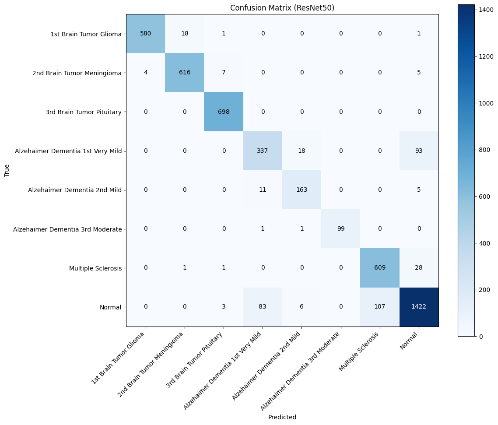

# 🧠 Multi-Class Neurological Disorder Detection from Brain MRI using Deep Learning

An end-to-end **deep learning–based medical imaging system** to classify **multiple neurological disorders and normal brain MRI scans** using **ResNet50 transfer learning**, with strong emphasis on **high recall and AUC**, critical for clinical safety.

---

## 📌 Project Overview

This project builds a **multi-class MRI classification pipeline** capable of detecting **8 neurological brain conditions** from MRI scans.  
It is designed to assist **early diagnosis and clinical decision support** by minimizing false negatives in disease detection.

The model leverages **ResNet50 pretrained on ImageNet**, combined with **advanced preprocessing, class imbalance handling, focal loss, and fine-tuning** to achieve high performance.

---

## 🛠 Tech Stack
- Python
- TensorFlow / Keras
- NumPy, Pandas
- Matplotlib, Seaborn
- Scikit-learn
- OpenCV
- Google Colab

---

## 🧠 Problem Statement

Neurological disorders such as **brain tumors, Alzheimer’s disease, and multiple sclerosis** require accurate and early diagnosis.

However:
- Manual MRI analysis is **time-consuming**
- Diagnosis depends heavily on **expert availability**
- Class imbalance often leads to **missed disease cases**

This project applies **deep learning and transfer learning** to automatically classify MRI scans with **high recall**, reducing the risk of undetected disorders.

---

## 🗂 Dataset

**Source:** Kaggle – *Three Brain Neurological Classes MRI Scans* (Extended)

### Classes Used (8):
- 1st Brain Tumor – Glioma  
- 2nd Brain Tumor – Meningioma  
- 3rd Brain Tumor – Pituitary  
- Alzheimer’s Dementia – Very Mild  
- Alzheimer’s Dementia – Mild  
- Alzheimer’s Dementia – Moderate  
- Multiple Sclerosis  
- Normal Brain  

### Dataset Highlights:
- ~24,000+ MRI images
- Highly **imbalanced medical dataset**
- RGB consistency enforced across all images

### Preprocessing:
- Removal of corrupted / invalid files  
- Image mode normalization (RGB conversion)  
- Resize to **224 × 224**  
- TensorFlow data pipelines (`tf.data`)  
- On-the-fly data augmentation  

---

## ⚙️ Methodology

### 1️⃣ Exploratory Data Analysis (EDA)
- Class distribution analysis
- Visual inspection of MRI samples
- Channel consistency verification (RGB / grayscale)

### 2️⃣ Data Pipeline
- Stratified train–validation split
- TensorFlow `Dataset` API for performance
- Augmentation:
  - Horizontal flip
  - Rotation
  - Zoom
  - Contrast adjustment

### 3️⃣ Model Architecture
- **ResNet50 (ImageNet pretrained)**
- Global Average Pooling
- Dense (512) + Dropout (0.5)
- Softmax output for multi-class classification

### 4️⃣ Training Strategy
**Phase 1 – Feature Extraction**
- ResNet base frozen
- Class weights applied
- Categorical Focal Loss

**Phase 2 – Fine-Tuning**
- Last 35 layers unfrozen
- Lower learning rate
- Performance-based callbacks

---

## 🧮 Loss Function & Optimization

- **Categorical Focal Loss**
  - Handles class imbalance
  - Focuses learning on hard-to-classify samples
- Optimizer: **Adam**
- Learning rate scheduling via `ReduceLROnPlateau`

---

## 📊 Evaluation Metrics

Medical models cannot rely on accuracy alone.

Metrics used:
- **Accuracy**
- **AUC (Multi-label ROC AUC)**
- **Precision / Recall / F1-Score**
- **Confusion Matrix**

👉 **Recall was prioritized** to reduce false negatives (missed disease cases).

---

## 🏆 Final Results

### 🔹 Overall Performance
| Metric | Value |
|------|------|
Validation Accuracy | **91.99%**
Validation AUC | **0.9952**
Macro Avg Recall | **0.93**
Weighted Avg F1-Score | **0.92**

### 🔹 Class-Wise Highlights
- Brain Tumor classes: **Recall up to 1.00**
- Alzheimer’s Moderate: **Recall 0.98**
- Multiple Sclerosis: **Recall 0.95**
- Normal class recall kept slightly lower intentionally (clinical safety trade-off)

---

## 📈 Confusion Matrix

  
   
  <em>Figure: Confusion Matrix for 8-class MRI classification</em>

---

## 🔮 Future Work
- External validation on independent MRI datasets
- Explainable AI (Grad-CAM) for clinical interpretability
- Binary abnormal-vs-normal pre-screening model
- Deployment as a clinical decision support tool

---
